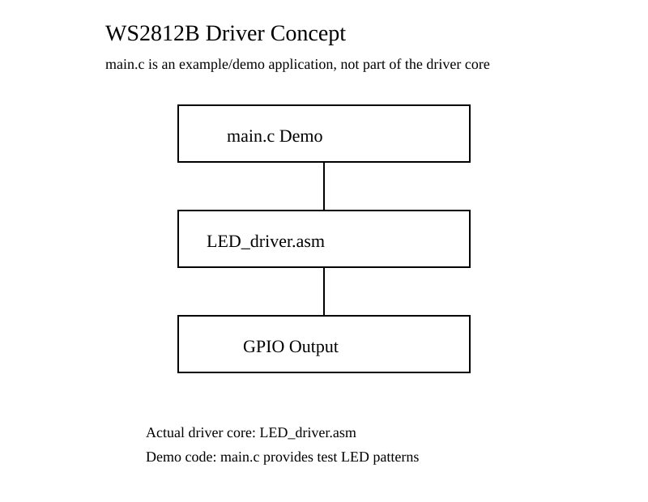
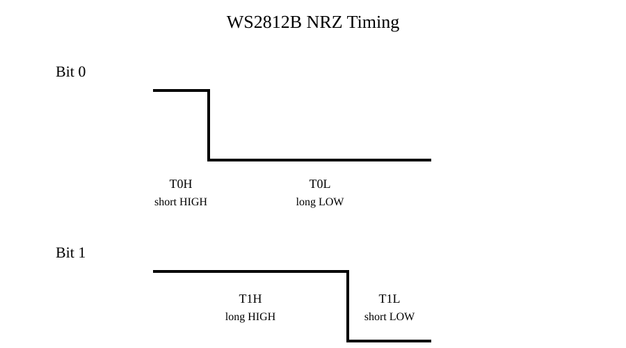

# LED Lamp Belt Driver for WS2812B (8051 MCU)

A lightweight WS2812B LED strip driver implemented on an 8051 MCU using cycle-accurate GPIO bit-banging.

This project generates the WS2812B single-wire waveform entirely through carefully timed 8051 assembly instructions. It is designed for low-cost MCUs without dedicated peripherals such as PWM, SPI, DMA, or LED timing engines.

## Features

- 8051 MCU compatible
- C + Assembly mixed implementation
- No PWM / SPI / DMA required
- Software generated WS2812B NRZ waveform
- Assembly-level GPIO timing control
- Suitable for resource-limited MCUs

## Project Structure

```
LED-lamp-belt-driver-for-WS2812B
|
├── LED_driver.asm
|       Core WS2812B timing driver
|
├── main.c
|       Example/demo application
|
└── docs
        Timing and architecture diagrams
```

## Driver Architecture



The actual driver core is `LED_driver.asm`.

`main.c` is only a demonstration program showing how to prepare LED data and call the assembly driver. In a real application, the application layer can be replaced by any user code that provides LED color data.

## WS2812B Protocol

WS2812B uses a single-wire NRZ protocol. Each LED requires 24 bits of color data:

```
Green 8 bits
Red   8 bits
Blue  8 bits
```

Timing information is encoded by the HIGH pulse width.



## Assembly Timing Engine

The key idea of this project is to use the 8051 CPU instruction cycle as a waveform generator.

```
Assembly instruction timing
          |
          v
GPIO HIGH / LOW waveform
          |
          v
WS2812B data transmission
```

The driver uses carefully arranged instruction sequences and NOP delays to generate different timing for bit 0 and bit 1.

## Data Flow Example

```
Application code
      |
      v
LED color buffer
      |
      v
LED_driver.asm
      |
      v
GPIO output
      |
      v
WS2812B DIN
```

## Buffer Configuration

The demo application defines a LED buffer:

```c
Uint8 idata Data_Tab[126] _at_ 0x80;
```

Each LED requires 3 bytes:

```
1 LED = RGB = 3 bytes
```

Therefore:

```
126 / 3 = 42 LEDs
```

The buffer size can be changed according to the application requirement.

## GPIO Configuration

The default output pin is defined in assembly:

```asm
PIN_NZR EQU P3.1
```

Modify this definition to use another GPIO pin.

## Timing Calibration

The waveform timing depends on:

- MCU clock frequency
- instruction cycle length
- compiler/build configuration

When porting the driver:

1. Recalculate instruction timing
2. Adjust NOP delay sections
3. Verify T0H/T0L/T1H/T1L using an oscilloscope or logic analyzer

## Advantages

- Works on very small MCUs
- Requires only one GPIO pin
- Does not require special LED peripherals
- Demonstrates cycle-accurate embedded programming

## Limitations

- CPU is occupied during transmission
- Timing depends on clock frequency
- Interrupts may affect waveform accuracy

## Project Idea

This project demonstrates how software timing and assembly-level control can replace missing hardware peripherals when implementing strict timing protocols on resource-constrained embedded systems.
